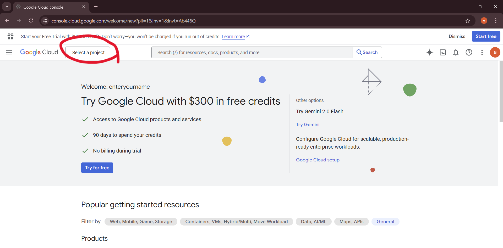

프로그램 사용설명서
==================
## installer 설치
그냥 따라가면 된다. 프로그램 자체가 간단하여 폴더경로 수정 외에는 건드릴것도 별로 없다.

### 파일 구성
1. 화면 디자인을 담당하는 UI파일 4개
2. 모듈 역할을 하는 py파일 3개와 실제 구동하는 app.py(총 4개)
3. 설정값을 조정하는 setting.json과 tts를 불러오기 위한 키를 제공하는 boss-tts-key.json
4. 패키징 과정을 설정하는 app.spec
5. 캐릭터 디자인이 담겨있는 images 폴더
6. 파이썬 모듈이 들어있는 __pycache__ 폴더

이곳에서 사용자가 실제로 조정할 파일은 boss-tts-jso폴더이다.

설치경로는 C:/Program Files(x86)이다. 

## 키 발급받는 방법
준비물 : 구글 계정, 카드

사실 TTS는 매월 100만자를 무료로 제공하기 때문에 실제로 결제가 진행될 일은 없다. 매일 3만자를 써도 100만자를 채우지 못하기 때문이다. 그러나 기본적으로 이 API는 유료이므로 "등록"해놓을 카드가 하나 필요하다. 누구 한명이 희생하자.

1.구글 클라우드에 접속한다
[구글 클라우드](https://console.cloud.google.com)

권한 동의 후 메인화면에 접속했다면 좌상단의 프로젝트 선택을 클릭한다.
.png)
</img>

이후 새 프로젝트를 누르고 적당한 이름의 프로젝트를 만든다. 

선택까지 해주면 활성화된다.

이후 검색창에서 
Cloud Text-to-Speech API를 검색한다.
