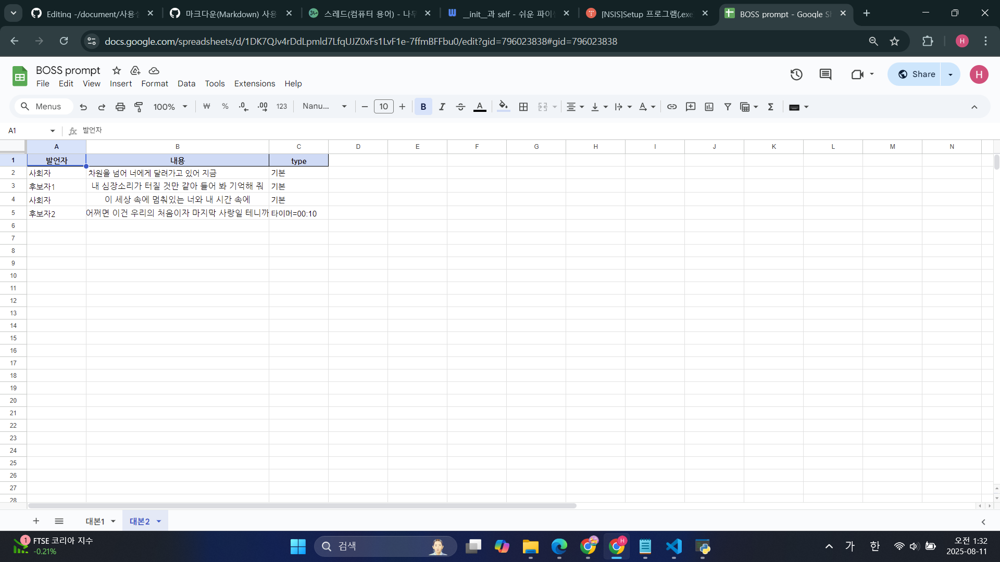
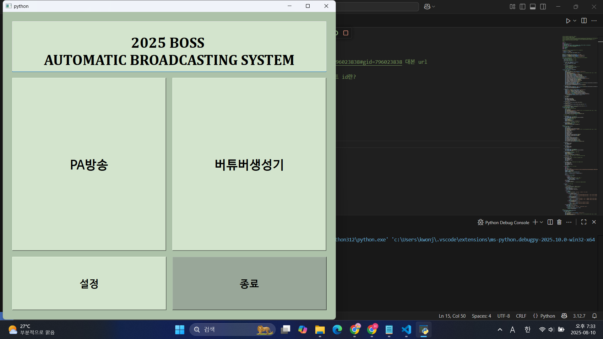
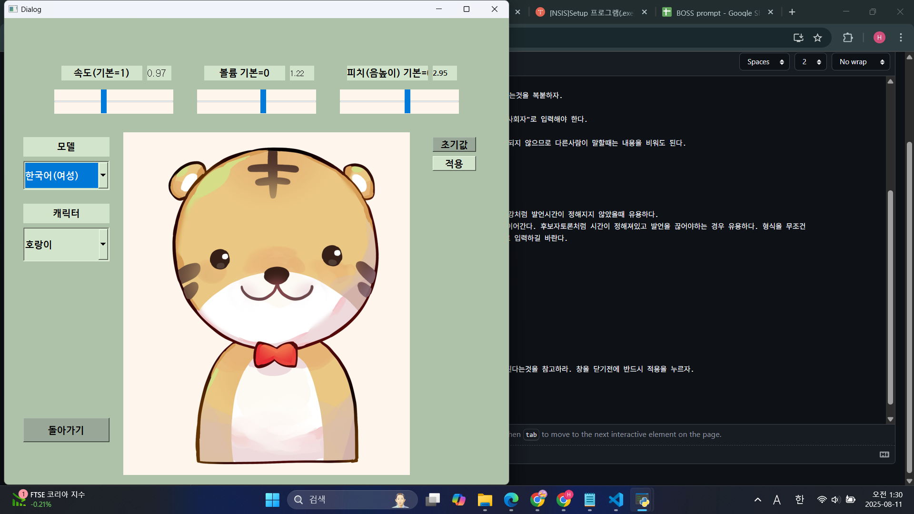
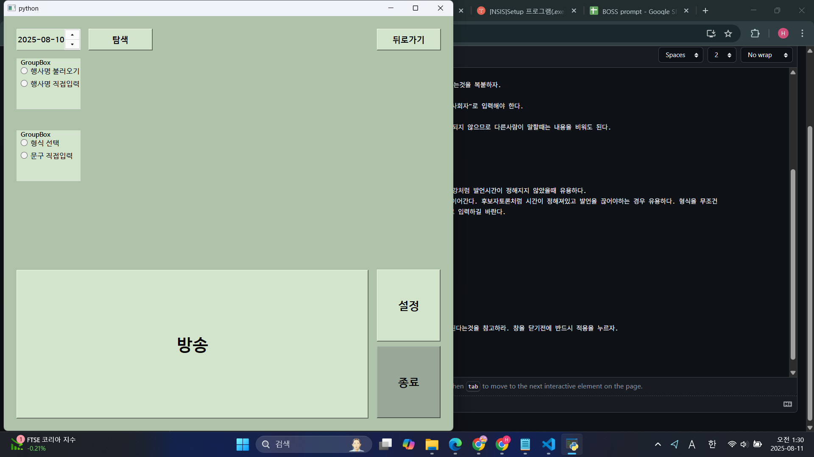
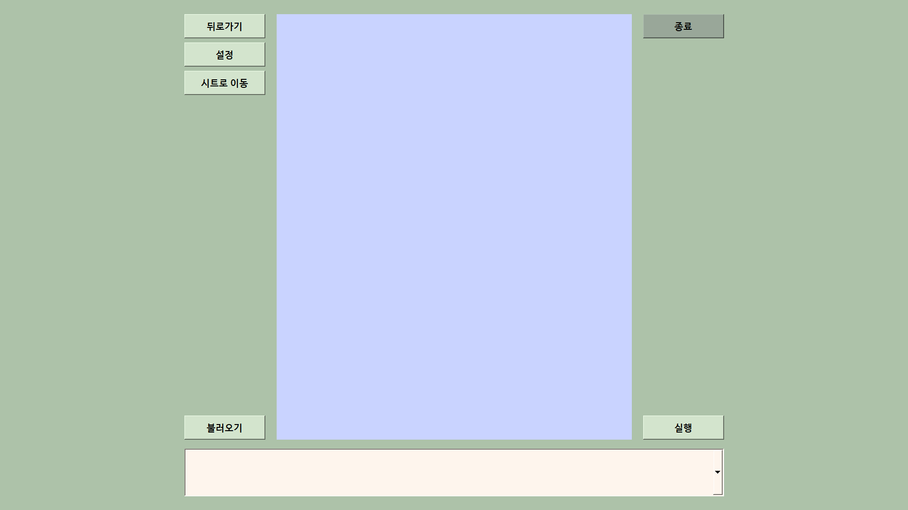

사용설명서
======

## 스프레드시트 사용법

#### 행사목록

잘 모르겠다. 알아서 하시길. 

#### 대본

[대본 시트](https://docs.google.com/spreadsheets/d/1DK7QJv4rDdLpmld7LfqUJZ0xFs1LvF1e-7ffmBFFbu0/edit?gid=796023838#gid=796023838)

대본은 시트로 구분한다. 좌측 하단 +를 눌러 시트를 새로 추가한 후 시트명에 행사 이름을 입력하자.

양식을 맞춰야 한다. 맨 윗줄에 발언자, 내용, type을 입력하자. 귀찮으면 예시에 있는것을 복붙하자.

'발언자'에서 다른 사람이 말하는것은 상관없지만 TTS가 말해야하는 부분은 무조건 "사회자"로 입력해야 한다.

'내용'에서는 말할 내용을 입력한다. 사실 '발언자'가 사회자인것 외에는 TTS에 입력되지 않으므로 다른사람이 말할때는 내용을 비워도 된다.

'type'에서는 말그대로 발언의 유형을 정한다.

1. 사회자가 말하는 경우 무조건 '내용'에 있는 텍스트를 말한다.
2. '발언자'가 사회자가 아닐경우 두 가지 선택지가 있다.
   >1. type이 '기본'일 경우 프로그램에 엔터키를 입력할때까지 기다린다. 강사 특강처럼 발언시간이 정해지지 않았을때 유용하다.
   >2. type이 '타이며=MM:SS'일 경우 =이후 적힌 시간만큼 멈춘 후 다음 발언을 이어간다. 후보자토론처럼 시간이 정해져있고 발언을 끊어야하는 경우 유용하다. 형식을 무조건
   >   타이머=분:초로 맞춰야 하며 0분 또는 0초라도 4자리를 맞춰 00:00의 형태로 입력하길 바란다.

</img>

## 앱 사용법

#### 메인화면
앱을 열면 가장먼저 뜨는 화면이다. 별 기능은 없고 창 사이 연결고리 역할을 해준다.
</img>

#### 설정
설정이다. 내용이 직관적이니 참고할것. 참고로 무조건 '적용'을 눌러야 설정이 적용된다는것을 참고하라. 창을 닫기전에 반드시 적용을 누르자.
</img>

#### PA방송
</img>

사용자는 총 2개를 선택해야한다.

1. 문구 내용
2. 행사명

1.문구 내용

형식 선택과 직접 입력 중 선택할 수 있다.

형식 선택의 경우 정해진 문구에 행사명을 대입하는 구조이며, 행사명 선택이 필수이다.

직접 입력은 모든 글자를 직접 입력하며, 행사명을 정할 필요 없다. 분실물 방송 등에 유용하게 활용될 수 있다.

만약 직접 입력에서 행사명을 집어넣고 싶으면 {event}를 적어넣자. 해당 위치에 행사명이 대입되어 방송될 것이다.

2.행사명
시트에서 불러오기와 직접 입력 중 선택 가능하다.

불러오기의 경우 날짜를 고르면 해당 날짜의 행사가 불러와진다.

직접 입력의 경우 직접 입력하면 된다.

두 작업을 마치고 방송 버튼을 누르면 음성이 나올 것이다.

#### 버추얼 아나운서

</img>

불러오기를 누르면 대본 목록이 로드되고, 하나를 선택해 실행을 누르면 대본 서식대로 실행된다. 

이 창은 카메라를 대체하는 것이므로 전체화면(F11) 형태로 띄워진다.

만약 종료하고싶다면 종료버튼을 누르거나 뒤로가기를 하자.

